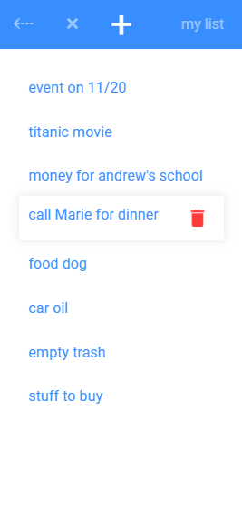

# lister
List system to add and remove item

## languages
 * javascript (ECMA5 compatible)
 * HTML 5
 * CSS 3

## Used systems
 * BoolMaster 
   * Automatically linked to hugocastaneda.fr boolMaster.
   * Alterable in the [lister.js (L183)](https://github.com/hugodecasta/lister/blob/master/lister.js#L183) file.
   * System available on github : [BoolMaster](https://github.com/hugodecasta/boolMaster)

## Preview

